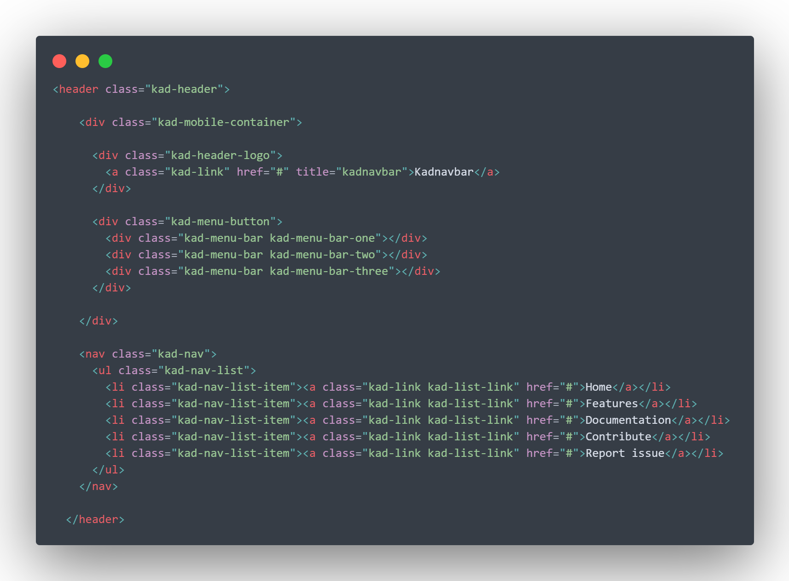

<div align="center">

# Kadnavbar

Responsive navbar with zero bootstrap/jQuery dependencies and css cross-bow nav button animation.

[](https://github.com/acekyd/made-in-nigeria)
[](http://opensource.org/licenses/MIT)
[](http://makeapullrequest.com)



</div>


## Features

* No jQuery or external js libraries
* Completely independent 
* Doesn't break main stylesheet
* Super responsive
* 100% css animations
* Can accomodate various range of nav brand size
* Semantic html markup
* Extra support for [font-awesome](https://fontawesome.com/) icons

## Demo

Demo preview is available on the [github page demo of the repo](https://kadetxx.github.io/kadnavbar/).

## Quick Usage Guide

You can either download asset folder and link up in your html code or link to the files directly from google servers (I couldn't get a real cdn but google is just as fast as cloudflare or maxcdn).

### Using google servers

1. Copy and paste the css link below into your index.html file in the header. This link should come before your main style link in your header in order to allow navbar edits in your main css file. 

```html
<link rel="stylesheet" href="https://sites.google.com/site/kadnavcdn/home/styles.css">
```
2. Copy and paste this js script link in your index.html file just before the closing body tag.

```html
<script src="https://sites.google.com/site/kadnavcdn/home/script.js"></script>
```
3. Structure your header as specified below or preferrably, copy the default html structure for the header navbar below and paste inside your index.html file just after the opening body tag.

```html
<header class="kad-header">

    <div class="kad-mobile-container">

      <div class="kad-header-logo">
        <a class="kad-link" href="#" title="kadnavbar">Kadnavbar</a>
      </div>

      <div class="kad-menu-button">
        <div class="kad-menu-bar kad-menu-bar-one"></div>
        <div class="kad-menu-bar kad-menu-bar-two"></div>
        <div class="kad-menu-bar kad-menu-bar-three"></div>
      </div>

    </div>

    <nav class="kad-nav">
      <ul class="kad-nav-list">
        <li class="kad-nav-list-item"><a class="kad-link kad-list-link" href="#">Home</a></li>
        <li class="kad-nav-list-item"><a class="kad-link kad-list-link" href="#">About</a></li>
        <li class="kad-nav-list-item"><a class="kad-link kad-list-link" href="#">Contact</a></li>
        <li class="kad-nav-list-item"><a class="kad-link kad-list-link" href="#">Support</a></li>
      </ul>

    </nav>

  </header>

```
4. Save changes.

### Downloading Source files

1. Download kadnavbar [zip file here](https://sites.google.com/site/kadnavcdn/home/kadnavbar%20v1.0.zip?attredirects=0&d=1).
2. Unzip file into your root project folder.
3. Copy and paste the css stylesheet link below into your index.html file in the header.

```html
<link rel="stylesheet" href="kadnavbar/css/styles.css">
```
4.  Copy and paste this js script link in your index.html file just before the closing body tag.

```html
<script src="kadnavbar/js/script.js"></script>
```
5. Structure your header as specified in the code snippet above for google server method above or preferrably copy the snippet and paste.
6. Save changes.

## Icons and buttons

Kadnavbar also supports extra buttons or icons at the right side of the header (desktop view). To use this feature, simply add the `kad-nav-extra` div to the default html header just before the closing `nav` tag. Replace the `i` tags with icons of your choice. 

```html

<header class="kad-header">

    <div class="kad-mobile-container">

      <div class="kad-header-logo">
        <a class="kad-link" href="#" title="kadnavbar">Kadnavbar</a>
      </div>

      <div class="kad-menu-button">
        <div class="kad-menu-bar kad-menu-bar-one"></div>
        <div class="kad-menu-bar kad-menu-bar-two"></div>
        <div class="kad-menu-bar kad-menu-bar-three"></div>
      </div>

    </div>

    <nav class="kad-nav">
      <ul class="kad-nav-list">
        <li class="kad-nav-list-item"><a class="kad-link kad-list-link" href="#">Home</a></li>
        <li class="kad-nav-list-item"><a class="kad-link kad-list-link" href="#">Features</a></li>
        <li class="kad-nav-list-item"><a class="kad-link kad-list-link" href="#">Documentation</a></li>
        <li class="kad-nav-list-item"><a class="kad-link kad-list-link" href="#">Contribute</a></li>
        <li class="kad-nav-list-item"><a class="kad-link kad-list-link" href="#">Report issue</a></li>
      </ul>

      <div class="kad-nav-extras">
        <button class="kad-nav-button">Download</button>
        <div class="kad-nav-icons">
          <a href="#"><i class="fab fa-github"></i></a>
          <a href="#"><i class="fab fa-twitter"></i></a>
          <a href="#"><i class="fab fa-codepen"></i></a>
          <a href="#"><i class="fas fa-hashtag"></i></a>
          <a href="#""><i class="fas fa-envelope"></i></i></a>
        </div>
      </div>

    </nav>

  </header>
```
Don't forget to include the icon library stylesheet link in your html `head`. By default, kad nav bar is set to use font awesome icons (I recommend this) so you can just copy the icon library stylesheet link below and paste it inside your html `head` tag. 

```html
<link rel="stylesheet" href="https://cdnjs.cloudflare.com/ajax/libs/font-awesome/5.11.2/css/all.min.css">
```
You can as well add/delete icons and/or button. By default, this navbar uses one buttton and five icons

## Transparent/Light Version

The default Kadnavbar has a dark background color which can abe switched by changing the background-color property of the `kad-header` class. I decided to add a feature for a transparent navbar for lighter background colors. You can make the navbar transparent by adding the `kad-header-transparent` class to the `header` tag as shown below.

```html
<header class="kad-header kad-header-transparent">
    
    ...
    
</header>    
```

## Licensing 

This project is an opensource project under the MIT license and can be used for personal or commercial use, can be distributed and also modified. [View full license here](https://github.com/kadetXx/kadnavbar/blob/master/license.md).

## Contributing

This project is open to collaborators and contributors from all over the world. Kindly report an issue or fork repo, edit and create a pull request.

## Author

Collins Enebeli

> Originally inspired by bootstrap's navbar component and a failed attempt to use it on my webpage without importing the full bootstrap's styling because it tampers with the styling of all other elements on the page.
